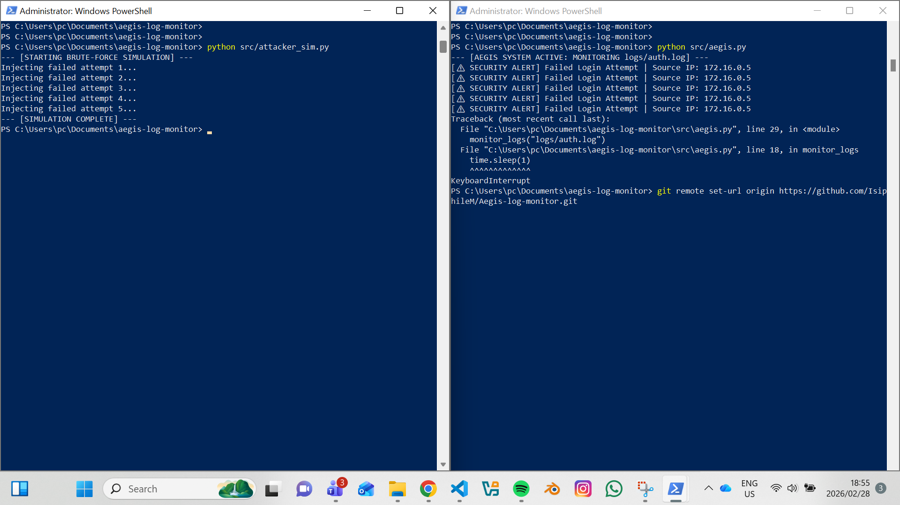

# 🛡️ Project: Aegis Log Monitor

### Project Specifications
* **Primary Function:** Real-time Log Parsing & Brute-Force Detection
* **Core Logic:** `Regular Expressions (Regex)` for automated pattern extraction
* **Analysis Type:** Behavioral Analysis (Differentiating failed vs. successful logins)
* **Operational Status:** ACTIVE / Monitoring Phase
* **Application:** SIEM (Security Information & Event Management) Fundamentals

---

### Technical Methodology
Aegis is a defensive security tool designed to simulate the core functionality of a **Host-based Intrusion Detection System (HIDS)**. It monitors system authentication logs (`auth.log`) to identify and alert on unauthorized access attempts in real-time.

**The Defensive Workflow:**
1. **Log Trailing:** The script opens the target log and utilizes a `while` loop to monitor new entries as they are written to disk.
2. **Regex Parsing:** Each new line is scanned using a specific regex pattern (`from ([\d\.]+) port`) to isolate the attacker's metadata.
3. **Artifact Extraction:** When a "Failed password" signature is detected, the script extracts the **Source IP Address** for immediate visibility.
4. **Correlation:** The tool distinguishes between failed attempts (threats) and "Accepted" logins (authorized users).

---

### Key Features
* **Zero-Latency Monitoring:** Real-time file-tailing using Python's `time` and `os` modules.
* **Signature Recognition:** Tailored Regex matching for unstructured SSH log data.
* **SOC Dashboard Alerts:** High-visibility terminal alerts designed for security operations monitoring.
* **Threat Simulation:** Includes an internal `attacker_sim.py` script to generate synthetic brute-force traffic for system testing.

---

### System Output (Demo)

*Above: Aegis detecting injected brute-force attempts from the simulated attacker script in real-time.*

---

### Installation & Execution
```powershell
# 1. Clone & Navigate
git clone [https://github.com/IsiphileM/Aegis-log-monitor.git](https://github.com/IsiphileM/Aegis-log-monitor.git)
cd Aegis-log-monitor

# 2. Start the Monitor (Defender Window)
python src/aegis.py

# 3. Run the Simulation (Attacker Window)
python src/attacker_sim.py
